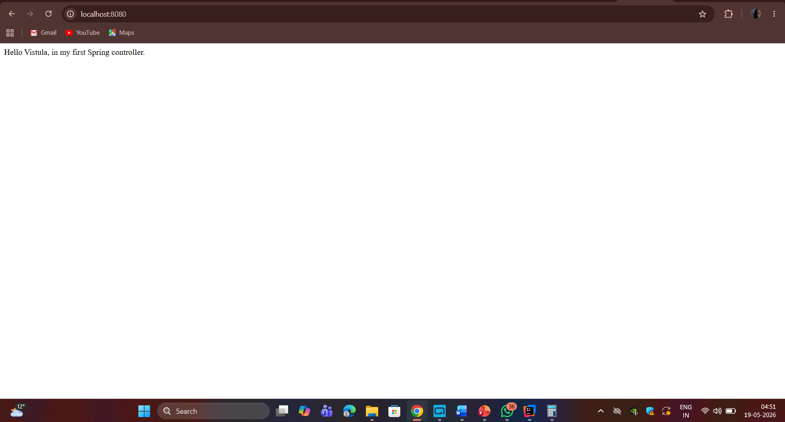
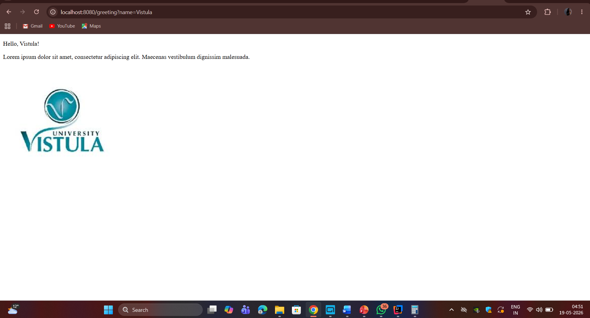

# First Project Java Spring

A Spring Boot MVC application built as part of the Vistula University 
Spring Framework course.

## Description
This application demonstrates the basics of Spring Boot MVC with:
- Spring Controller
- Thymeleaf template engine
- @ResponseBody annotation
- HTTP GET requests

## Technologies Used
- Java 17
- Spring Boot
- Spring MVC
- Thymeleaf
- Maven

## How to Run
1. Clone the repository
2. Open in IntelliJ IDEA
3. Run `FirstProjectJavaSpringApplication.java`
4. Open browser and go to `http://localhost:8080`

## Endpoints

| Method | URL | Description |
|--------|-----|-------------|
| GET | `/` | Returns hello message |
| GET | `/greeting?name=Vistula` | Returns greeting page with image |

## Screenshots

### Root Endpoint - localhost:8080/

### Greeting Page - localhost:8080/greeting?name=Vistula

### Greeting Page

## What I Learned
- How to create a Spring Boot project
- Difference between @Controller and @RestController
- How @ResponseBody works
- How to use Thymeleaf templates
- How to serve static images
